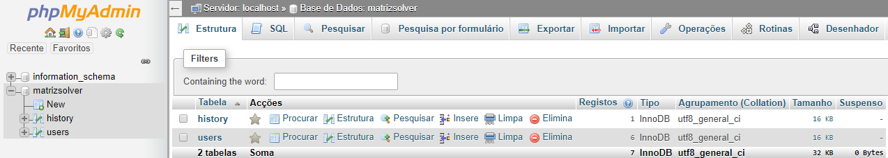
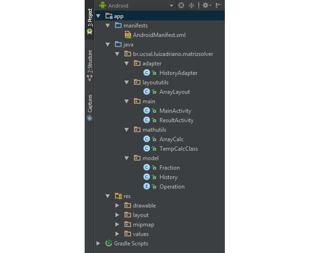
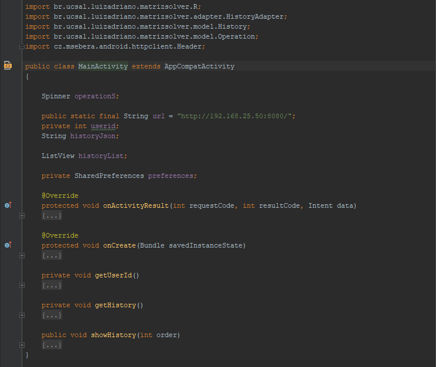
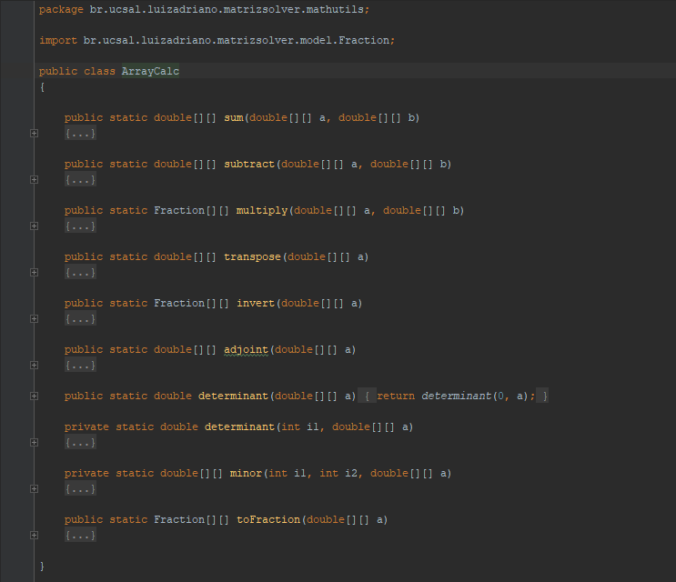
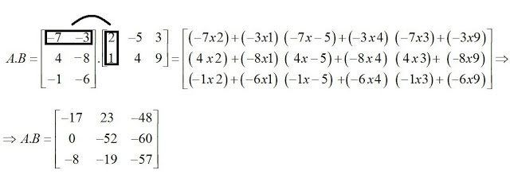
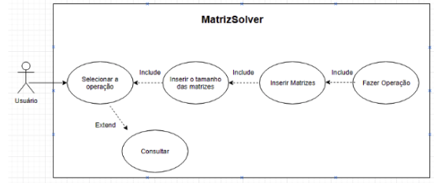
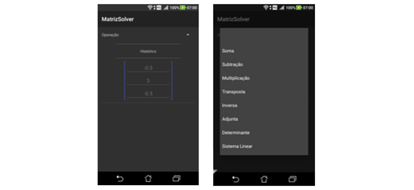
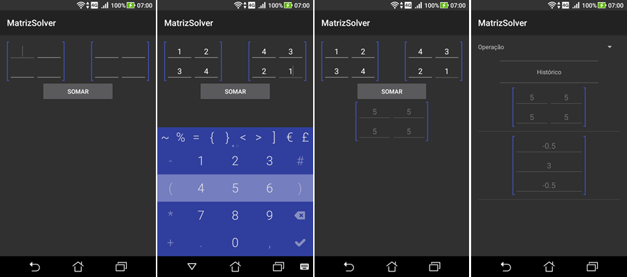
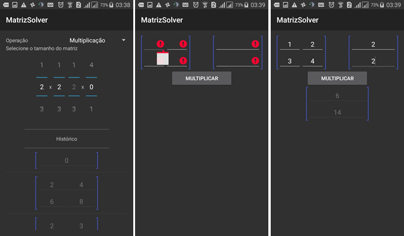

# MATRIZ SOLVER

**Desenvolvimento de um App Para Resolução de Operações com Matrizes**

**Adriano R. A. Araújo¹**, **Luiz Henrique Rios¹**

1 Bacharelado em Engenharia de Software – 4º Semestre -  Universidade Católica de Salvador (UCSal)

Salvador – BA – Brasil

{adrianor.araujo, luiz.rios}@ucsal.edu.br

**Resumo.** _Operações com matrizes envolvem complexidade, para auxiliar estudantes, professores e até curiosos, de forma que o usuário possa resolver tais operações de forma simples, o Matriz Solver foi desenvolvido. Este artigo descreve as etapas do desenvolvimento desse App para dispositivos móveis, Matriz Solver, onde temos um descritivo dos requisitos, dos casos de uso, diagrama UML, descrição da arquitetura, as tecnologias empregadas, e um Mockup das telas. O App foi desenvolvido para Android à partir do 4.4 KitKat._

**Palavras-chaves:** _Android, Matrizes, Matriz Solver, KitKat_

**Abstract.** _Matrix operations involve complexity, to help students, teachers and even curious, so that the user can solve such operations in a simple way, Matriz Solver was developed. This article describes the steps in the development of this mobile app, Matriz Solver, where we have a description of the requirements, use cases, UML diagram, architecture description, the technologies used, and a screens Mockup. The app was developed for Android, requires 4.4 KitKat and up._

**Keywords:** _Android, Matrix, Matriz Solver, KitKat_

**1 INTRODUÇÃO**

Operações com matrizes são operações que envolvem complexidade e minuciosidade, mas devido a confiabilidade e precisão na resolução de problemas de engenharia e computação, são muito utilizadas tanto por profissionais da área, quanto por alunos e professores de disciplinas correlatas. No mercado existem softwares como o Matlab e o Scilab, que realizam tais operações e utilizam linguagens próprias, similares com a linguagem C++. Em dispositivos móveis existem softwares que realizam algumas operações com matrizes, porém a grande maioria nãooferece a funcionalidade de realizar tais operações utilizando uma linguagem mais próxima do usuário comum. Nesse projeto desenvolvemos um software do tipo app em android para realizar tais operações, onde o usuário comum pode utilizá-lo sem grandes preocupações com as notações das linguagens de programação. As operações que usuário pode realizar são: Soma, subtração, multiplicação, transposta, inversa, determinante, adjunta e resolução de sistemas por escalonamento.

**2 OBJETIVOS**

Para resolver as questões de realizar operações complexas com matrizes, como soma, subtração, multiplicação, determinante, adjunta, inversa, transposta e resolução de sistemas lineares, em um espaço de tempo pequeno, e de forma portátil, o Matriz Solver foi desenvolvido.

**3 REQUISITOS**

Este app foi desenvolvido para Android em linguagem Java, utilizando a IDE Android Studio 3.1.3. Para tal, foram seguidas as especificações descrita nos requisitos funcionais e não funcionais a seguir.

**3.1 Requisitos Funcionais**

RF001 – Selecionar a operação :

_Ao abrir o aplicativo aparecerá para o usuário uma tela com as opções das operações com matrizes e disponíveis no App, Soma, Subtração, Multiplicação, Determinante, Cofator, Inversa , Transposta e Resolução de Sistemas, e também a opção de Consulta._

RF001.1 - Exceção 01:

_Caso o usuário clicar no símbolo de retorno do Android, fechará o aplicativo._

RF002 - Consultar :

_Ao selecionar a opção de Consulta, o usuário terá acesso a um histórico com suas últimas operações realizadas no App._

RF002.1 - Exceção 02 :

_Caso o usuário não tenha nenhuma operação no histórico, não aparecerá histórico e mostrará apenas o menu inicial._

RF003 – Selecionar o tamanho da(s) matriz(es) :

_Após selecionar a operação desejada o usuário deverá digitar no campo especificado o número de linhas e colunas da(s) matriz(es) a serem trabalhadas._

RF003.1 Exceção 03:

_Caso o número de colunas e(ou) de linhas for incompatível com determinada operação o sistema não permitirá a continuidade do erro, ele voltará para a opção de inserção do número de linhas e colunas._

RF003.2 - Exceção 04:

_Caso o usuário queira retornar um passo anterior, basta clicar no símbolo de retorno do Android, e o app voltará ao passo anterior._

RF004 – Inserir os valores da Matriz:

_Após selecionar a operação desejada e inserir o tamanho da(s) matriz(es), aparecerão campos para inserção dos números de acordo com o tamanho da(s) matriz(es) informado(s)._

RF004.1 - Exceção 05:

_Caso o usuário não escolha nenhum valor em algum dos campos e apertar ok, o campo ficará marcado como incorreto, não permitindo a continuidade da operação até que o mesmo esteja preenchido._

RF004.2 - Exceção 06:

_Caso o usuário queira retornar um passo anterior, basta clicar no símbolo de retorno do Android, e o app voltará ao passo anterior._

RF005 – Fazer a Operação:

_Após inserir os valores da(s) matriz(es) o usuário selecionará a opção de realizar operação, e em seguida será realizada a operação, mostrando na tela o resultado da operação._

RF005 - Exceção 07:

_Caso o usuário queira retornar um passo anterior, basta clicar no símbolo de retorno do Android, e o app voltará ao passo anterior._

RF006 – Salvar:

_Após mostrar o resultado da operação realizada com a(s) matriz(es), o sistema irá automaticamente salvar o resultado da operação realizada no histórico de operações para consulta posterior._

RF007 – Início:

_Após mostrar o resultado da operação realizada com a(s) matriz(es), o usuário tem um campo com a opção de Retornar ao início para realizar uma nova operação ou consultar o histórico das operações._

RF008 – Sair:

_Para Sair do App basta clicar no campo navegável no canto superior e depois em sair, ou clicar no símbolo de retorno do android até que o App feche._

**3.2 Requisitos Não-Funcionais**

RNF01 – A aplicação é feita paraAndroid à partir do 4.4 KitKat

RNF02 – A aplicação necessita de conexão com a internet para funcionar.

RNF03 – O SGBD utilizado será armazenamento em banco MySQL.

RNF04 – A Manutenção será feita por atualizações disponíveis na PlayStore

**4 METODOLOGIA**

**4.1 Ferramentas Utilizadas**

Nosso App não tem uma estrutura de banco de dados complexa, pois só armazenamos os resultados das 5 últimas operações do usuário, onde os resultados dessas operações são embutidas em campos textuais no formato JSON, sendo convertidos com a biblioteca Gson.
> JSON (JavaScript Object Notation) é uma formatação leve de troca de dados... baseado em um subconjunto da linguagem de programação JavaScript ...é em formato texto e completamente independente de linguagem"
> [json.org,2018]

O desenvolvimento do App foipara Android à partir do 4.4 KitKat, e para o desenvolvimento do layout do App, interação com o servidor web, gerenciamento dos dados das operações, e a integração com as funcionalidades, foi utilizada a IDE Android Studio 3.1.3, onde usamos a linguagem Java. O layout do App é dinâmico, ele muda a apresentação da tela conforme a interação do usuário, como no caso da Na criação dos métodos de resolução das operações matriciais, foi utilizado a IDE Eclipse Oxigen 3, onde em linguagem Java, pudemos realizar os testes com as resoluções das operações anteriormente supracitadas, para a partir daí colocarmos as mesmas no android Studio, evitando assim uma sobrecarga de memória em cada simulação de layout nos momentos dos testes no App.

**4.2 Arquitetura do Software**

Conforme mencionado anteriormente, nosso banco de dados é bem simples, pois possui apenas duas tabelas conforme imagem 1, onde temos o usuário (users), e o histórico (history), onde colocamos guardamos o result que vai no Json.

| **Imagem 1** : Modelo do Banco de Dados |

 

| **Fonte:** Próprio autor |

A partir daí pega-se os dados do Json e salva no Banco no MySQL, e ao buscar os dados na web, usa-se o Gson para traduzir os dados do Json para a aplicação. Abaixo podemos visualizar a estrutura do banco. A aplicação web, que é a API do projeto, também foi desenvolvida na linguagem Java e executa o processo de intermediar os dados do App Matriz Solver para o banco de dados e do banco de dados para o App.

| **Imagem 2** : Estrutura do Banco de Dados do Matriz Solver |
| --- |

 

|
| **Fonte:** Próprio autor |

Com relação ao desenvolvimento do layout no Android Studio, foi-se utilizado um padrão de estrutura onde foram utilizados alguns Linear Layouts dentro de um activity (imagem 4), para que a interface apresentada ao usuário seja dinâmica e se ajuste conforme a interação, disponibilizando campos para inserção de dados matriciais de acordo com o tipo de operação e o tamanho da matriz selecionada.

| **Imagem 3** : Estrutura do Projeto no Android Studio |
| --- |

 

|
| **Fonte:** Próprio autor |

| **Imagem 4** : Estrutura do MainActivity |
| --- |

 

|
| **Fonte:** Próprio autor |

Os métodos de resolução das operações matriciais foram todos escritos em Java e se dispõem no projeto na pasta MatrizSolver. Para tal, construímos essa parte do código no Eclipse Oxygen e depois dos mesmos terem passado nos testes unitários, colocamos na pasta do projeto conforme imagem abaixo.

| **Imagem 5** : Print da tela com os métodos de resolução das operações
 

 |
| --- |
|   |
| **Fonte:** Próprio autor |

**4.3 Conceitos Matemáticos Empregados**

Baseado no fato de que o Matriz Solver resolve matrizes e que durante seu desenvolvimento precisamos ensinar ao software como resolver essas operações com matrizes criando métodos algoritmos, foi de extrema relevância o estudo dos conceitos matemáticos correlatos. Dentre eles, operações entre matrizes, cálculo de determinantes, cofator, matriz adjunta, cálculo da inversa, métodos de cramer, método de gauss, sistemas lineares, etc…

_&quot;Em_ [matemática](https://pt.wikipedia.org/wiki/Matem%C3%A1tica)_, determinante é uma_ [função matricial](https://pt.wikipedia.org/wiki/Fun%C3%A7%C3%A3o_matricial) _que associa a cada_ [matriz](https://pt.wikipedia.org/wiki/Matriz_(matem%C3%A1tica))[quadrada](https://pt.wikipedia.org/wiki/Matriz_(matem%C3%A1tica)#Matriz_quadrada) _um_ [escalar](https://pt.wikipedia.org/wiki/Escalar)_; ela transforma essa matriz em um_ [número real](https://pt.wikipedia.org/wiki/N%C3%BAmero_real)_.&quot;__ Esta função permite saber se a matriz tem ou não_ [inversa](https://pt.wikipedia.org/wiki/Matriz_inversa)_, pois as que não têm são precisamente aquelas cujo determinante é igual a_ [0](https://pt.wikipedia.org/wiki/Zero)_.&quot;_[Campagner, 2013].

| **Imagem 6** : Determinante de uma Matriz |
| --- |
|
 

 |
| **Fonte:** wikipedia  |

Segundo IEZZI 2002, definimos a soma das matrizes e como sendo a matriz em que , ou seja, somar A com B consiste em somar termos correspondentes, se ambas têm a mesma quantidade de linhas e de colunas. Já na multiplicação, realizamos um produto escalar entre uma matriz A e B, onde obrigatoriamente, o número de colunas de A deve ser igual ao número de linhas de B.

| **Imagem 7** : Soma e Multiplicação de Matrizes |
| --- |
|
 

 
 
 

|
| **Fonte:** www.infoescola.com |

"_Dizemos que o sistema linear é, respectivamente, impossível, possível e determinado ou possível e indeterminado, conforme o conjunto solução seja vazio, unitário ou possua pelo menos dois elementos&quot;...&quot; o escalonamento consiste em encontrar um sistema equivalente ao sistema dado usando operações básicas de tal forma que o sistema encontrado seja um sistema escalonado_."

Todos os métodos criados para a resolução de matrizes foram baseados no estudo matemático dos conceitos acima mencionados.

**4.4 Casos de Uso**

O App Matriz Solver, se apresenta conforme os casos de uso e o diagrama UML. Seguem abaixo os descritivos dos casos de uso e o diagrama UML.

UC001 – Selecionar Operação

Pré-Requisito: O sistema deve estar aberto.

Fluxo Principal:

1. Esse caso de uso se inicia quando o usuário abre o sistema

2. O Sistema redireciona o usuário para uma tela  com as opções das operações com matrizes e disponíveis no App, Soma, Subtração, Multiplicação, Determinante, Adjunta, Inversa , Transposta e Resolução de Sistemas, e também as cinco últimas operações realizadas.

3. O Usuário deverá selecionar as opções de operação entre matrizes

4. O Sistema  direciona para a seleção do tamanho da(s) matriz(es) a serem utilizadas..

Fluxo Alternativo (Histórico):

1. O fluxo de exceção se inicia quando se seleciona uma operação realizada no histórico ao invés de &quot;Operação&quot;.
2. O usuário terá a opção de retornar à operação realizada anteriormente desejada ao clicar na mesma.

UC002 – Inserir tamanho da(s) matriz(es)

Pré-Requisitos: O usuário deve ter selecionado a operação realizada no passo anterior.

Fluxo Principal:

1. Esse caso de uso se inicia com o sistema disponibilizando a opção de inserir em dois campos, linhas e colunas, o tamanho das matrizes a serem trabalhadas.

2. O Usuário deverá preencher os dois campos.

4. O Sistema deverá direcionar o usuário para a tela de inserção dos dados da matriz.

 UC003 – Inserir matriz(es)

Pré-Requisito: O usuário deve ter inserido o tamanho das matrizes no passo anterior.

Fluxo Principal:

1. Esse caso de uso se inicia com o sistema disponibilizando a opção de inserir os números nos campos disponíveis de acordo com o tamanho da matriz desejada.

2. O Usuário deverá preencher os campos de inserção dos números adequadamente ao tamanho da matriz.

3. O Usuário deverá preencher e selecionar os campos de inserção e selecionar o botão que realizará a operação.

4. O Sistema deverá obter as informações dos números feitas pelo usuário e realizar a operação desejada.

Fluxo de Exceção

1. Caso o usuário deixe de inserir dado em um campo da matriz, o app não permitirá a continuidade impossibilitando aquela operação.

  UC004 – Fazer Operação

Pré-Requisito: O usuário deve ter inserido os números, que compõe a matriz a ser operada, no passo anterior.

Fluxo Principal:

1. Este caso de uso se inicia quando o usuário, após inserir os números do passo anterior, selecionar a opção de realizar operação.

2. O Sistema deverá apresentar o resultado da operação solicitada pelo usuário.

**4.5 Uml Diagrama de Casos de Uso**

| **Imagem 8** : Diagrama UML |
| --- |
|
 

|
| **Fonte:** Próprio Autor   |

**5 RESULTADOS**

Baseado nos requisitos funcionais e não funcionais, nas especificações de projeto, como os casos de uso, e diagrama UML,  o Matriz Solver foi desenvolvido de tal forma que atende a essas demandas específicas, e esses resultados estão dispostos nos subitens 5.1 Apresentação do Aplicativo, 5.2 Recursos, Funcionalidades e Vantagens, e 5.3 Limitações.

**5.1 Apresentação do Aplicativo**

 Objetivando tornar o App intuitivo e atrativo para os usuários, diferentes tipos de interfaces, com diferentes layouts foram testados, e no final optamos por dispor na tela principal um menu no canto superior esquerdo com as opções das operações matriciais, e no meio da interface, o histórico, de forma que o usuário possa escolher visualizar o histórico ou realizar uma operação, tudo numa mesma tela. Outro detalhe importante foi que eliminamos a possibilidade de fundo com cor clara no App, pois apesar de remeter a uma folha de papel para o usuário, gera um maior consumo de bateria. Optou-se pela interface  (fundo Grafite) que melhor realçava o texto de (cor branca), além de ser atrativa.

| **Imagem 9** : Tela Inicial com histórico e menu de operações |
| --- |
|
 

|
| **Fonte:** Próprio Autor |

Nas telas que seguem ao se escolher a operação com matrizes, o  aplicativo disponibiliza os campos para que se escolha o(s) tamanho(s) da(s) matriz(es) a ser(em) operada(s). para em seguida gerar a(s) matriz(es) vazia(s) onde o usuário preenche com os dados. O processo é concluído ao selecionar a opção que realiza a operação, mostrando o resultado , e salvando no histórico

| **Imagem 12** : Telas de uma resolução de soma entre matrizes e salvando histórico |
| --- |
|
 

 |
| **Fonte:** Próprio Autor |

Seguem abaixo algumas outras telas do Matriz Solver.

| **Imagem 11** : Telas de uma resolução de um determinante e salvando histórico |
| --- |
|
 

 |
| **Fonte:** Próprio Autor  |

**5.2 Recursos, Funcionalidades e Vantagens**

   Na Imagem 12, são apresentadas algumas telas do Matriz Solver que exemplificam o uso do App para realizar uma multiplicação entre matrizes. Para que não ocorra de que uma matriz venha a tentar ser multiplicada por outra incompatível, foi utilizado um recurso onde ao se escolher a dimensão da primeira matriz, o número de linhas da outra já aparece de forma compatível, eliminando assim esse tipo de erro.  Outra funcionalidade, é que o não preenchimento da matriz em determinada operação, passa por um recurso validação de campo, onde se verifica a variável atribuída àquele campo da matriz como sendo nula ou não (Imagem 12). O aplicativo não permite que uma operação seja realizada se a matriz não for completamente preenchida antes de realizar a operação.

 Uma das vantagens do Matriz Solver em relação a outros softwares que realizam operações matriciais, é o fato de que ele foi pensado para ser especializado. Ele apenas resolve as operações básicas descritas em seus requisitos, tornado-o assim uma calculadora de matriz portátil. Outra vantagem do Matriz Solver, é a forma intuitiva de ser usar, tornando-o funcional não só para usuário experientes e especializados, mas também para o usuário comum.

| **Imagem 12** : Telas de uma resolução de multiplicação entre matrizes |
| --- |
|
 

 |
|   **Fonte:** Próprio Autor |

**5.3 Limitações**

Umas das limitações do aplicativo é o fato de ele não apresentar uma análise do sistema linear durante a resolução, classificando em Sistema possível e determinado (SPD), Sistema possível e Indeterminado (SPI), ou Sistema Impossível (SI). Fato esse que poderá ser corrigido numa futura atualização do App, possivelmente emitindo um toast com essa classificação do sistema.

Outra limitação do aplicativo está no caso de uma possível classificação em SPI, onde ele deveria mostrar os resultados em função de uma variável específica (Imagem 13), permitindo ao usuário enxergar a gama de possibilidades da resolução de um SPI.

| **Imagem 13** : Resolução de um Sistema possível e Indeterminado (SPI) |
| --- |
 

|
| **Fonte:** www.alunosonline.uol.com.br |

**4 CONLUSÃO**

     Nesse projeto foram contemplados todos os requisitos pré estabelecidos conforme a concepção do mesmo, cumprindo assim com todo o escopo de arquitetura  planejado . Com relação às funcionalidades do App,  o Matriz Solver se mostrou bastante satisfatório em seu funcionamento, cumprindo os casos de uso gerados a partir da análise dos requisitos. As dificuldades durante a implementação ocorreram devido a busca pelo conhecimento matemático e técnico, que ocorreu em paralelo com o desenvolvimento do App, e também devido ao ciclo de testes realizados durante todo o processo de implementação, onde erros surgiam devido a exceções que não eram inicialmente tratadas, mas que com o caminhar da pesquisa e consultas, eram sanadas gradativamente, possibilitando ao final do projeto um App funcional conforme o tópico que trata das funcionalidades, e com melhorias a serem feitas conforme o tópico que trata das limitações do software.

**REFERÊNCIAS**

IEZZI, G.; HAZZAN, S. Fundamentos de Matemática Elementar. São Paulo: SARAIVA, S.A. vol. 4, 2002.

SILVA, Hugo Victor. Solução de sistemas lineares através do método computacional para alunos da educação básica. 2013. 41 f. Dissertação (Mestrado em Matemática em Rede Nacional) – Centro de Ciências, Universidade Federal do Ceará, Fortaleza, 2013.

CAMPAGNER, CARLOS ALBERTO. [«Determinante»](http://educacao.uol.com.br/matematica/determinante-numero-representa-matriz.jhtm). UOL - Educação. Consultado em 28 de maio de 2018

JSON: Introdução ao Json. 1999. Disponível em: \&lt;https://www.json.org/json-pt.html\&gt;. Acesso em: 24 maio 2018.

DETERMINANTE: conceitos. Disponível em: \&lt;https://pt.wikipedia.org/wiki/Determinante#cite\_note-UOL\_-\_Educa%C3%A7%C3%A3o-1\&gt;. Acesso em: 18 jun. 2018.

MATRIZES: Operações com Matrizes. Disponível em: \&lt;https://www.infoescola.com/matematica/operacoes-com-matrizes-1/\&gt;. Acesso em: 13 jun. 2018.
